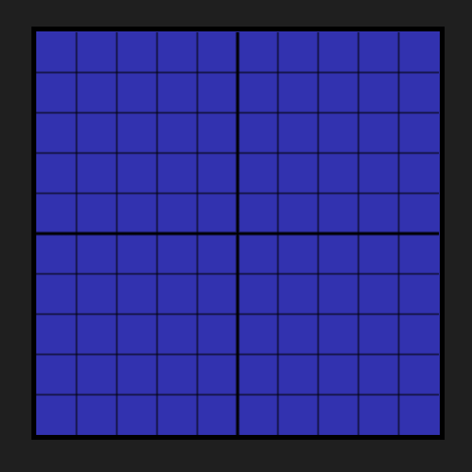

# Connect Four Gravity

Hey, guys, hey there ! 

Today, we are proud to present our **new project**.
CFG is a version of the famous **Connect 4**. Only, a **gravity** system is added... Instead of just playing, *why not break your head a little ?*
ㅤ
ㅤ
## Summary

* [Acknowledgements](#acknowledgements)
* [Introdution](#introdution)
* [Somes Advices](#somes-advices)
* [FAQ](#faq)
* [Biography](#biography)
* [Footnotes](#footnotes)
ㅤ
ㅤ
## Acknowledgements

My name is [Gaspard Lebaube](#gaspard-lebaube) and I am with my **beautiful** colleague [Kamil Leys](#kamil-leys). 

We would first like to thank some people who helped us for this project from time to time indirectly...

We thank the creators:
ㅤ
ㅤ
## Introdution

Here is our **beautiful** game:

Just a tray of 10×10 boxes...
Not much, yes, but **potential**...
Okay, now, if I tell you there are chips, and... that’s it: a tray and chips... 

It’s already a good base. *Who wants better ?*
Me ?! I am indeed a bit demanding...

So maybe I’ll add some rules, huh ? 
There, as soon as you line up **4 chips**, you have **won**... But... It reminds me of a game... Of course not !

Well I know that there you find the game far too complicated, indeed it is so far a *torture* for your brain... So watch out, it’ll get hot:

*We’re sure Earth... right ?* 
Good well, I must see revealed that there is **gravity** ! No, it’s not a joke !

So the chips will go to the bottom of it...
So let’s resume... So there is a gravity that is naturally towards the **bottom** of the plateau... **If you don't turn it over of course !!!** 

Now shift the gravity (which we will symbolize as a *line*) and put it in the **middle** of the tray. 
The chips that will be placed on **top** will land at this line... The tokens that will be placed at the **bottom**, will go back to the same line...

But it’s not over ! Hehe...
Now that we have our horizontal line, **add a vertical line...**
The chips will be drawn to the **middle** of the board ! 

And you just have to assemble the gravity and the tray... and line up your **4 chips** ! 

Simple ? Test it !
ㅤ
ㅤ
## Somes advices 

Okay, all right ! 
You have finally understood the general purpose of the game. Now is the time to pay more **attention to it**. 

At the beginning of a game, you will end up with 4 chips **already placed** (they are only used to start the game):

IMG

Afterwards, a pile or face is thrown (**honor** to the *smallest level* to choose its face).
The winning player will be able to place their chip **first**.

However, during the course of the game (*round by round*), you should listen to some of **my advices**:

1- To **win**, as you already know, you have to line up 4 chips either *horizontally*, *vertically* or *diagonally*. Remember that this rule applies everywhere on the board...

2- The chips will be attracted by **two different gravity** each time (example: *right and bottom*). So you have to look at where the token lands. You can activate directional arrows in the **settings** to help you.

3- If you have to leave the game **absolutely** or you are **sure** to lose, ***declare forfeit***, you will have 1 minute of exclusion **only** (you will benefit for your **fair play**). If you leave the game without forfeiting, you will have **10 minutes** of exclusion (in case of bad connection, **you can resume**).

4- And don’t forget that the **most important** thing is to have **fun**. It doesn’t matter if you lose, **you will progress** ! *Just time and training...*
ㅤ
ㅤ
## FAQ

**-** *"But how many game modes are there ?"*

> **There are now 4 game modes: a normal mode, a local mode, a ranked mode, and a mode that changes every week.**

**-** *"Are our banking and personal data safe ?"*

> **Yes, you can trust us... We even share the code of our app on** [GitHub](https://github.com/PatafixPLTX/CFG) **! So you can see where your data goes !** 

**-** *"How to play online with friends ?"*

> **It is enough that one of the players has the gravity pass... You will also discover other small advantages...**

**-** *"How can we support you ?"*

> **You can just play our game. But if you want to help us financially, do not hesitate to take a serious step or a small item in the shop.**

More questions ? Ask them [here](https://github.com/PatafixPLTX/CFG/discussions) !
ㅤ
## Biography

### Gaspard Lebaube

Good Luck

### Kamil Leys

Javascript = God

## Footnotes

